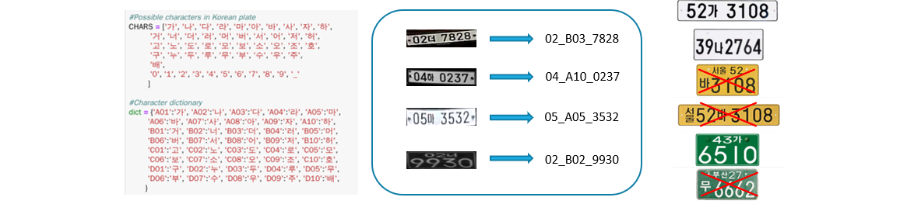
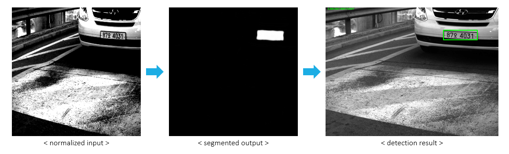
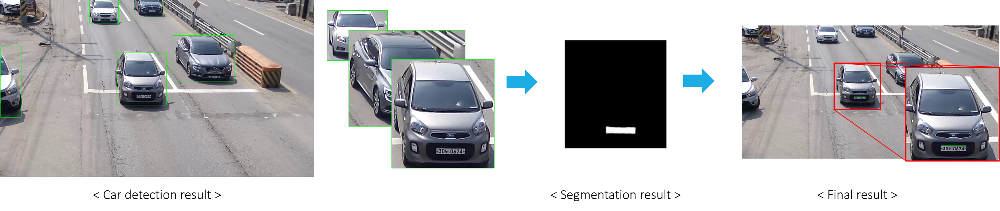
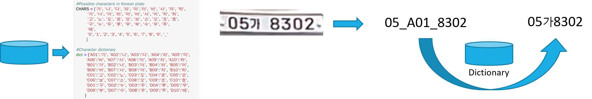

# License-Plate-Recognition
License Plate Recognition based on semantic segmentation approach

## Introduction
In license plate detection, we first detect the car using YOLO v3(pre-trained with COCO dataset) and we use semantic segmentation approach using U-Net.(coarse-to-fine manner) In license plate recognition, we use Automatic character recognition LPR-Net.

## Data preparation
### Plate detection
* Binary class label for segmentation
* [X, Y, W, H] plate position
* Plate characters

### Plate recognition
* Encode Korean characters
* Create dictionary

## License plate detection
* Adopt coarse-to-fine approach (car detection → plate detection) 
* Car detection using YOLO v3
* Semantic segmentation approach using U-Net

## License plate recognition
* Various character length
* Different position of characters
* Low resolution plate
* Ambiguous label

## Evaluation results
* Parking dataset

||Test1|Test2|
|------|---|---|
|num_bbox_examples|285|285|
|num_bbox_corrects|270|270|
|bbox_accuracy|94.74|94.74|
|num_rec_examples|285|285|
|num_rec_corrects|183|183|
|rec_accuracy|64.21|64.21|
|avg_pt|71.84|109.6|
|score|__161.76__|157.99|

* CCTV dataset

||Test1|Test2|
|------|---|---|
|num_bbox_examples|451|451|
|num_bbox_corrects|399|399|
|bbox_accuracy|88.47|88.47|
|num_rec_examples|436|436|
|num_rec_corrects|269|269|
|rec_accuracy|61.7|61.7|
|avg_pt|189.91|116.95|
|score|141.18|__148.47__|

## Prerequisites
* Python 3.5
* Tensorflow
* Pytorch
* OpenCV
